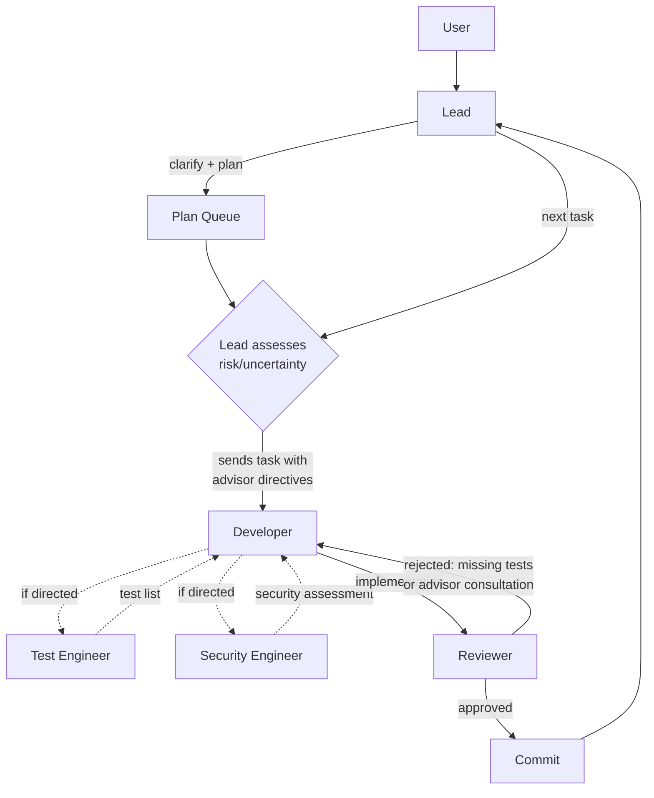

# Claude Orchestration Kit

Drop-in multi-agent orchestration for Claude Code. This
repository contains two things:

- **Blueprints** — `.claude/` setups that you copy into a
  project to get a team of specialized agents coordinated
  by your Claude Code session
- **Devcontainer templates** — Docker-based sandboxes for
  running agents in isolation

## Blueprints

A blueprint is a `.claude/` directory containing agent
definitions, workflows, rules, and skills. Copy one into
your project, start Claude Code, and your session becomes
the team lead.

| Blueprint | Approach | Agents |
|-----------|----------|--------|
| **autonomous** | Full autonomy after plan approval via a plan queue | Lead, Developer, Reviewer, Test Engineer, Security Engineer |
| **workflow** | User chooses a workflow after clarification | Lead, Architect, Developer, Test Engineer, Security Engineer, Reviewer |

### When to Use Which

| If you want... | Use |
|---|---|
| Maximum throughput, minimal interaction | autonomous |
| Full autonomy after plan approval | autonomous |
| Plan queue with concurrent clarification | autonomous |
| Lead stays responsive during execution | autonomous |
| Multiple workflow options (supervised, autonomous, TDD) | workflow |
| Per-commit user approval | workflow (Supervised) |

### Quick Start

```bash
# Copy a blueprint into your project
cp -r blueprints/autonomous/.claude/ /path/to/your/project/.claude/
# or
cp -r blueprints/workflow/.claude/ /path/to/your/project/.claude/
```

Start Claude Code in your project directory. The CLAUDE.md
loads automatically and configures your session as the team
lead.

Agent teams are an experimental Claude Code feature,
disabled by default. Each blueprint's `settings.json`
enables them automatically. You can also set the environment
variable directly:

```bash
export CLAUDE_CODE_EXPERIMENTAL_AGENT_TEAMS=1
```

### autonomous — Plan Queue + Developer

The lead handles clarification, planning, and plan queue
management. For each task, the lead assesses risk and
uncertainty at dispatch time and directs the Developer to
consult advisors when warranted. The lead stays responsive
to the user during execution — new requests become plans in
the queue.

**Agents:**

| Agent | Model | Role |
|-------|-------|------|
| Lead | Opus | Clarifies task, writes plans, manages plan queue |
| Developer | Sonnet | Implements all code (source + tests) |
| Reviewer | Opus | Quality gate — scope verification, plan tracking, commits |
| Test Engineer | Sonnet | Advisory — test lists on demand |
| Security Engineer | Sonnet | Advisory — security assessments on demand |



The Reviewer provides a backstop: non-trivial behavioral
changes without tests or advisor consultation are rejected.
The Developer-Reviewer rejection loop is opaque to the lead.

### workflow — Clarify-First

The lead clarifies the task, then presents workflow options.
The user chooses how work gets done. Workflows are separate
files in `.claude/workflows/` — adding one requires no
changes to CLAUDE.md.

**Agents:**

| Agent | Model | Role |
|-------|-------|------|
| Lead | Opus | Clarifies task, presents workflow options, coordinates |
| Architect | Opus | Reads codebase, writes plans, feeds tasks |
| Developer | Sonnet | Implements all code (source + tests) |
| Test Engineer | Sonnet | Advisory — designs test specs, verifies coverage |
| Security Engineer | Sonnet | Advisory — checks security gaps |
| Reviewer | Opus | Quality gate — reviews and commits |

**Workflows:**

- **Direct-Review** — lead handles work directly, Reviewer
  checks quality. For well-scoped tasks.
- **Develop-Review (Supervised)** — full dev cycle with
  Architect planning, test-list development, and user
  approval per commit.
- **Develop-Review (Autonomous)** — same as Supervised but
  commits automatically after Reviewer approval.
- **TDD User-in-the-Loop** — strict Red-Green-Refactor with
  user approval at every phase transition.

Language-specific guidance loads automatically via
conditional rules when agents touch matching files.
`/project-init` generates project context on first session.

## Devcontainer Templates

`devcontainer_templates/` provides Docker-based sandboxes
for running agents in isolation. Two variants are available:

| Template | Directory | Platform |
|----------|-----------|----------|
| **Base** | `.devcontainer/` | Cross-platform |
| **Audio** | `.devcontainer_audio/` | Linux (PulseAudio passthrough) |

```bash
# Copy into your project
cp -r devcontainer_templates/.devcontainer/ /path/to/your/project/.devcontainer/
```

**Features:**

- **Dual auth mode** — proxy (default) or OAuth, controlled
  by `CLAUDE_AUTH` in `.devcontainer/.env.local`
- **Project-scoped volume** — Claude config and history
  isolated per project
- **Host config as template** — `~/.claude/` mounted
  read-only, copied into container on startup

See each template's README for auth configuration,
troubleshooting, and mount details.

## Contributing

See [CONTRIBUTING.md](CONTRIBUTING.md) for how to develop
and extend blueprints — adding languages, workflows, agents,
skills, and running the test suite.

## Known Limitations

Agent teams are experimental. Be aware of:

- **No session resumption** — `/resume` and `/rewind` do
  not restore in-process teammates.
- **One team per session** — clean up the current team
  before starting another.
- **No nested teams** — only the lead can manage the team.
- **Lead is fixed** — the session that creates the team
  stays the lead.
- **Permission mode inherits** — all teammates start with
  the lead's permission mode (e.g., whether tool use
  prompts for approval). Agent `tools:` frontmatter
  independently restricts which tools each agent can use.
